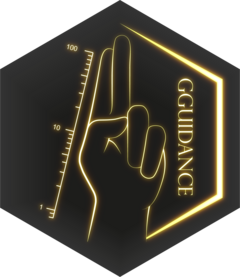

<!-- README.md is generated from README.Rmd. Please edit that file -->

```{r}
#| include: false
knitr::opts_chunk$set(
  collapse = TRUE,
  comment = "#>",
  fig.path = "man/figures/README-",
  out.width = "80%",
  dev = "svglite",
  dev.args = list(fix_text_size = FALSE),
  dpi = 132,
  fig.align = "center"
)
```

# legendry <a href="https://teunbrand.github.io/legendry/"></a>

<!-- badges: start -->
[](https://github.com/teunbrand/legendry/actions/workflows/R-CMD-check.yaml)
[](https://lifecycle.r-lib.org/articles/stages.html#experimental)
[](https://CRAN.R-project.org/package=legendry)
[](https://app.codecov.io/gh/teunbrand/legendry)
<!-- badges: end -->

The goal of legendry is to provide additional guide functionality to the ggplot2 ecosystem.

## Installation

You can install the development version of legendry from [GitHub](https://github.com/) with:

``` r
# install.packages("devtools")
devtools::install_github("teunbrand/legendry")
```

## Example

Let's first set up a basic plot to experiment with:

```{r}
#| label: basic_plot
library(legendry)

base <- ggplot(mpg, aes(displ, hwy, colour = cty)) +
  geom_point() +
  labs(
    x = "Engine displacement",
    y = "Highway miles per gallon",
    col = "City miles\nper gallon"
  ) +
  theme(axis.line = element_line())
```

The legendry package offers a selection of what it calls 'complete guides'. 
These complete guides can just be drop-in replacement of regular guides, which you can specify using ggplot2's `guides()` function or using the `guide` argument in scales.
In the example below, we're using two custom variants of vanilla guides, namely `guide_axis_base()` and `guide_colbar()`. These custom variants have additional options that allow a greater degree of customisation: 

* The axis guide has an option for bidirectional ticks.
* The colourbar automatically recognises out-of-bounds values and displays this with a cap.

```{r}
#| label: full_guides
base + 
  scale_colour_viridis_c(
    limits = c(NA, 30),
    guide = "colbar"
  ) +
  guides(
    x = guide_axis_base(bidi = TRUE)
  )
```

Besides complete guides, legendry also has incomplete guides that can be composed.
The `ggplot2::guide_axis_stack()` is an axis composition function that can be used to display multiple guides.
Here, we use a 'primitive' guide (incomplete building block) to display a range on the axis.
By stacking it with a regular axis the primitive guide is completed.

```{r}
#| label: primitives
# A partial guide to display a bracket
efficient_bracket <- primitive_bracket(
  # Keys determine what is displayed
  key = key_range_manual(start = 25, end = Inf, name = "Efficient"),
  bracket = "square",
  # We want vertical text
  theme = theme(
    legend.text = element_text(angle = 90, hjust = 0.5),
    axis.text.y.left = element_text(angle = 90, hjust = 0.5)
  )
)

base + guides(y = guide_axis_stack("axis", efficient_bracket))
```

The legendry package extends this guide composition concept beyond the axes for other types of guides.
In the example below we compose a 'sandwich': a central guide flanked by two others.
Because our bracket is a primitive, it does not matter what aesthetic it displays and we can re-use it for the sandwich.
I've yet to write the vignette on composition.

```{r}
#| label: composition
base + 
  scale_colour_viridis_c(
    guide = compose_sandwich(
      middle = gizmo_density(), 
      text = "axis_base",
      opposite = efficient_bracket
    )
  )
```

## Code of Conduct

Please note that the legendry project is released with a [Contributor Code of Conduct](https://teunbrand.github.io/legendry/CODE_OF_CONDUCT.html). By contributing to this project, you agree to abide by its terms.

