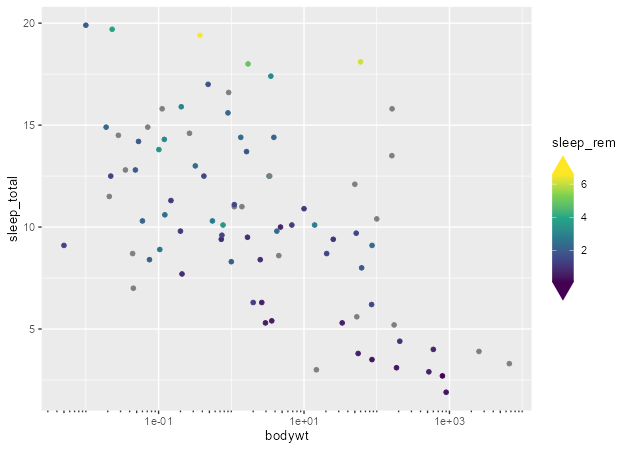

<!-- README.md is generated from README.Rmd. Please edit that file -->

# gguidance

<!-- badges: start -->
<!-- badges: end -->

The goal of gguidance is to provide additional guides to the ggplot2
ecosystem. Guides are re-implemented within the ggproto system to make
use of the flexible extension framework.

## Installation

You can install the development version of gguidance from
[GitHub](https://github.com/) with:

``` r
# install.packages("devtools")
devtools::install_github("teunbrand/gguidance")
```

## Example

As of now, there is only an re-implementation of
`ggplot2::guide_axis()`.

``` r
library(gguidance)
#> Loading required package: ggplot2

ggplot(mpg, aes(displ, hwy)) +
  geom_point() +
  guides(x = guide_axis_vanilla())
```



## Notes

A medium-term goal is to move and refactor guides from the {ggh4x}
package to {gguidance}. A longer-term goal is to make this package a hub
for additional axes, legends and other guides.
