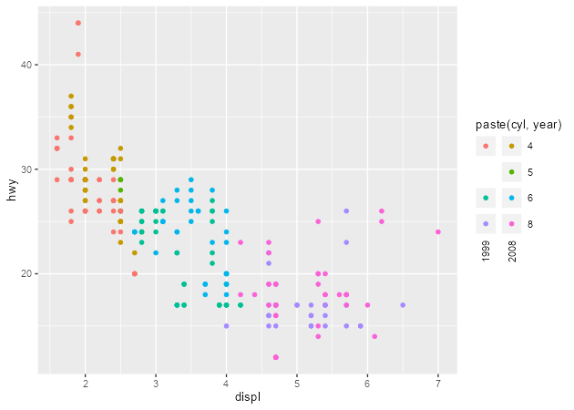
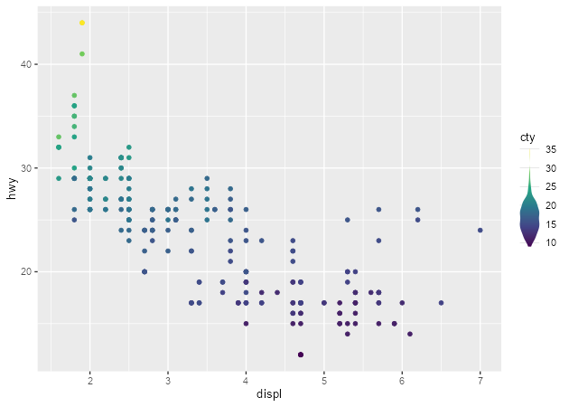
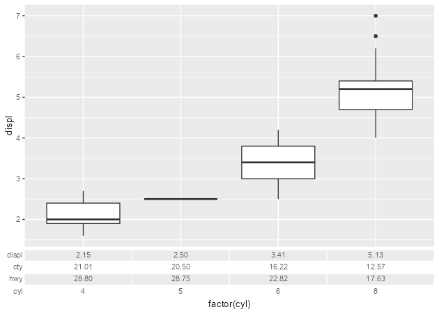

<!-- README.md is generated from README.Rmd. Please edit that file -->

# gguidance

<!-- badges: start -->

[](https://CRAN.R-project.org/package=gguidance)
[](https://lifecycle.r-lib.org/articles/stages.html#experimental)
[](https://app.codecov.io/gh/teunbrand/gguidance?branch=master)
[](https://github.com/teunbrand/gguidance/actions/workflows/R-CMD-check.yaml)
<!-- badges: end -->

> **Warning** You’re looking at an experimental branch that explores
> guide extensions with an upcoming ggproto overhaul in ggplot2.

The goal of gguidance is to provide additional guides to the ggplot2
ecosystem.

Please note that this repo is still being worked on and, while probably
usable, isn’t finished.

## Installation

You can install the development version of gguidance from
[GitHub](https://github.com/) with:

``` r
# install.packages("remotes")
remotes::install_github("tidyverse/ggplot2", ref = remotes::github_pull("5096"))
remotes::install_github("teunbrand/gguidance", ref = "main")
```

## Examples

A ‘cross legend’ can show two variables in a single legend.

``` r
library(gguidance)
#> Loading required package: ggplot2

ggplot(mpg, aes(displ, hwy)) +
  geom_point(aes(colour = paste(cyl, year))) +
  guides(colour = "legend_cross")
```



A capped legend:

``` r
ggplot(mpg, aes(displ, hwy)) +
  geom_point(aes(colour = cty)) +
  scale_colour_viridis_c() +
  guides(colour = guide_colourbar_cap())
```


Using a violin as a colour guide:

``` r
ggplot(mpg, aes(displ, hwy)) +
  geom_point(aes(colour = cty)) +
  scale_colour_viridis_c(
    guide = guide_colour_violin(density = mpg$cty)
  )
```



Using a table as an axis guide.

``` r
# Creating summary table
my_table <- lapply(split(mpg[, c("displ", "cty", "hwy")], mpg$cyl), colMeans)
my_table <- as.data.frame(do.call(rbind, my_table))
my_table[] <- lapply(my_table, scales::number, accuracy = 0.01)
my_table$cyl <- rownames(my_table)

# Use summary table as axis guide
ggplot(mpg, aes(factor(cyl), displ)) +
  geom_boxplot() +
  guides(x = guide_axis_table(table = my_table, key_col = cyl))
```


