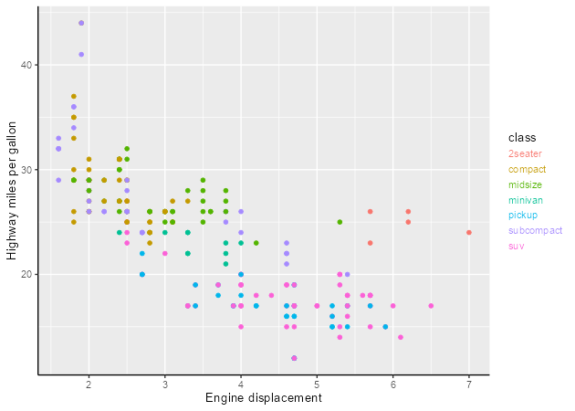
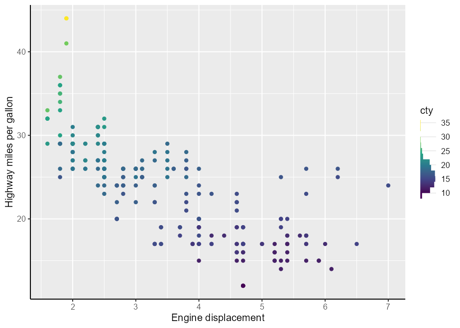
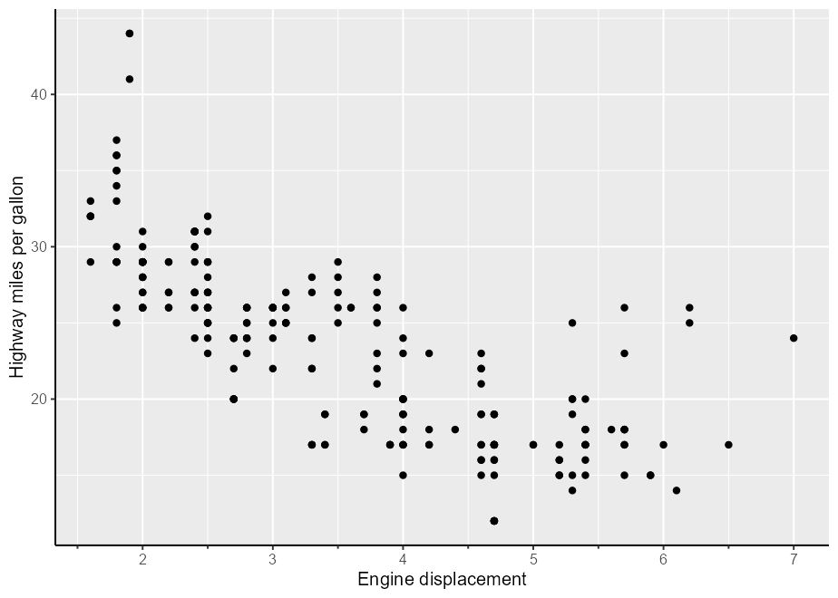
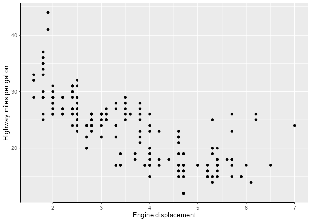
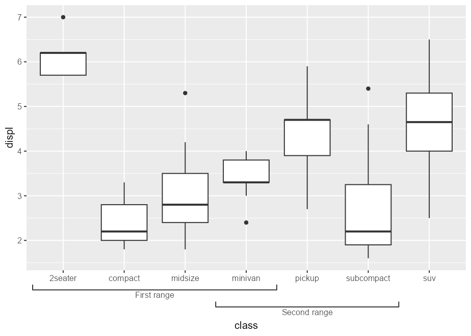
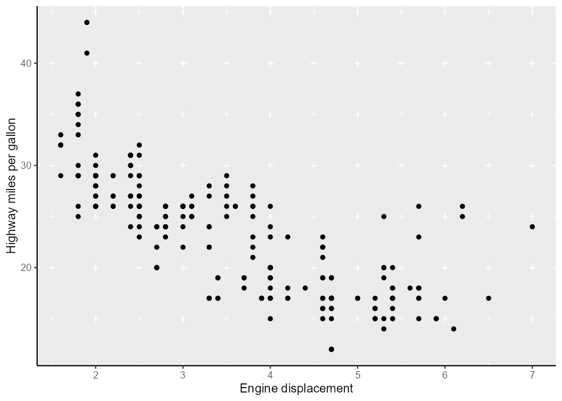
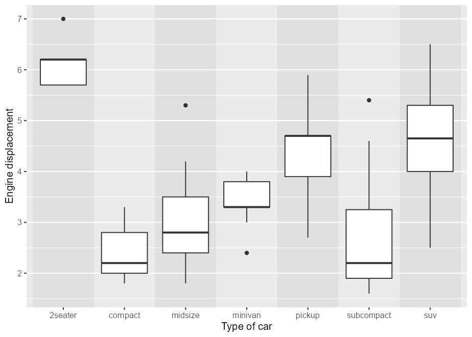

<!-- README.md is generated from README.Rmd. Please edit that file -->

# gguidance 

<!-- badges: start -->

[](https://CRAN.R-project.org/package=gguidance)
[](https://lifecycle.r-lib.org/articles/stages.html#experimental)
[](https://app.codecov.io/gh/teunbrand/gguidance?branch=master)
[](https://github.com/teunbrand/gguidance/actions/workflows/R-CMD-check.yaml)
<!-- badges: end -->

> **Warning** You’re looking at an experimental branch that explores
> guide extensions with an upcoming ggproto overhaul in ggplot2.

The goal of gguidance is to provide additional guides to the ggplot2
ecosystem.

Please note that this repo is still being worked on and, while probably
usable, isn’t finished.

## Installation

You can install the development version of gguidance from
[GitHub](https://github.com/) with:

``` r
# install.package("pak")
pak::pak("tidyverse/ggplot2") # Installs development version of ggplot2
pak::pak("teunbrand/gguidance@main") # Installs this package
```

## Overview

A table of contents of this package’s utilities:

1.  [Legends](#legends)
    1.  [Cross legend](#cross-legend)
    2.  [String legend](#string-legend)
2.  [Colour bars](#colour-bars)
    1.  [Capped colour bar](#capped-colour-bar)
    2.  [Violin colour bar](#violin-colour-bar)
    3.  [Histogram colour bar](#histogram-colour-bar)
3.  [Axes](#axes)
    1.  [Subtitles](#subtitles)
    2.  [Minor ticks](#minor-ticks)
    3.  [Capping](#capping)
    4.  [Ranges](#ranges)
    5.  [Table](#table)
4.  [Grids](#grids)
    1.  [Regular](#regular)
    2.  [Plus](#plus)
    3.  [Zebra](#zebra)

## Examples

Let’s first set up a basic plot to experiment with

``` r
library(gguidance)
#> Loading required package: ggplot2

p <- ggplot(mpg, aes(displ, hwy)) +
  geom_point() +
  labs(
    x = "Engine displacement",
    y = "Highway miles per gallon"
  ) +
  theme(axis.line = element_line())
```

### Legends

#### Cross legend

A ‘cross legend’ can show two variables in a single legend.

``` r
p + aes(colour = paste(cyl, year)) +
  guides(colour = "legend_cross")
```


#### String legend

A string legend doesn’t display keys, but colours the labels.

``` r
p + aes(colour = class) +
  guides(colour = "legend_string")
```



### Colour bars

#### Capped colour bar

A capped colour bar:

``` r
p + aes(colour = cty) +
  scale_colour_viridis_c(guide = "colourbar_cap")
```


#### Violin colour bar

Using a violin as a colour guide:

``` r
p + aes(colour = cty) +
  scale_colour_viridis_c(guide = guide_colour_violin(density = mpg$cty))
```


#### Histogram colour bar

Using a histogram as a colour guide:

``` r
p + aes(colour = cty) +
  scale_colour_viridis_c(
    guide = guide_colour_histogram(hist = hist(mpg$cty, breaks = 10))
  )
```



### Axes

#### Subtitles

Using subtitles.

``` r
p + guides(x = guide_axis_extend(subtitle = c("Less", "More")))
```


#### Minor ticks

Using minor ticks.

``` r
p + guides(x = "axis_minor")
```



#### Capping

Using capped lines.

``` r
p + guides(x = "axis_cap")
```



#### Ranges

With bracketed ranges.

``` r
boxplot <- ggplot(mpg, aes(class, displ)) +
  geom_boxplot() +
  labs(
    x = "Type of car",
    y = "Engine displacement"
  )

boxplot +
  guides(x = guide_axis_nested(
    range_start = c(0.5, 3.5),
    range_end   = c(4.5, 6.5),
    range_name  = c("First range", "Second range"),
    bracket     = "square" 
  ))
```



#### Table

Using a table as an axis guide.

``` r
# Creating summary table
my_table <- lapply(split(mpg[, c("displ", "cty", "hwy")], mpg$class), colMeans)
my_table <- as.data.frame(do.call(rbind, my_table))
my_table[] <- lapply(my_table, scales::number, accuracy = 0.01)
my_table$class <- rownames(my_table)

# Use summary table as axis guide
boxplot +
  guides(x = guide_axis_table(table = my_table, key_col = class))
```


### Grids

#### Regular

Like the vanilla panel grid, but with more options for where breaks
appear. Here, between categories.

``` r
boxplot +
  coord_guided(guide_grid(x_breaks = breaks_between()))
```


#### Plus

Subtler grid lines by only drawing the intersections, making a ‘plus’
symbol.

``` r
p + coord_guided("grid_plus")
```



#### Zebra

Alternating stripes between breaks.

``` r
boxplot + coord_guided("grid_zebra") +
  theme(panel.grid.major.x = element_line(alpha("grey50", 0.1)))
```


