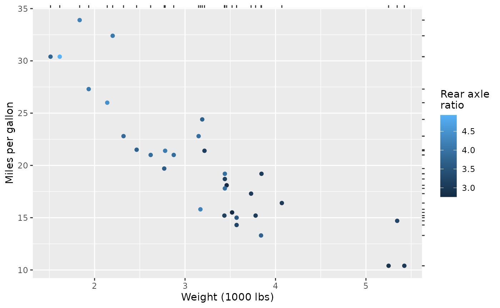
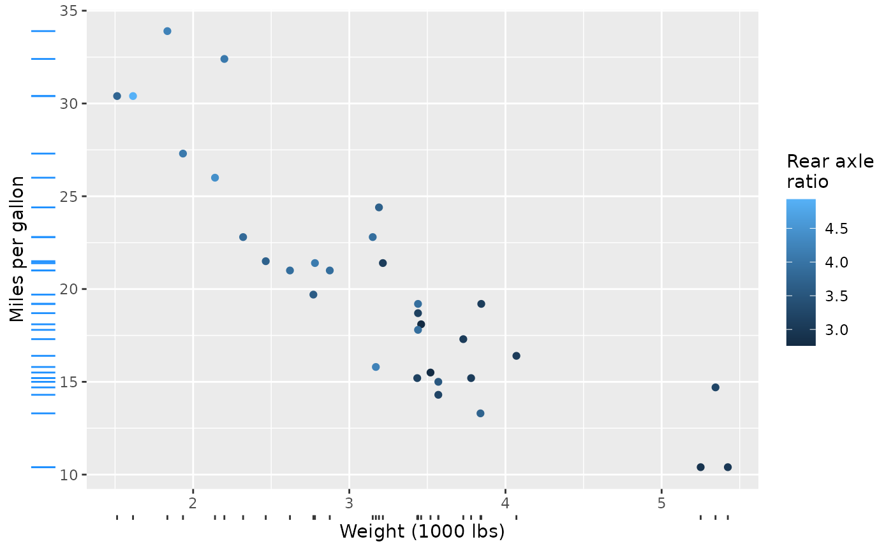
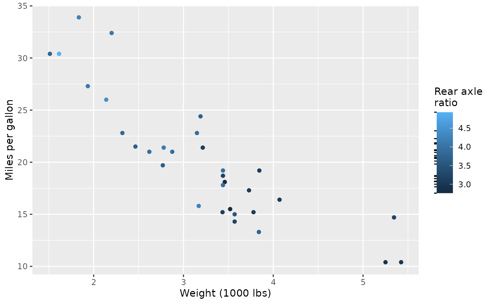

# Example Gallery

``` r

library(legendry)
#> Loading required package: ggplot2
```

This article is intended to showcase a few strategies to use the
building blocks that legendry provide to build more specialised guides.

## Rugs

An easy way to wrap a rug guide is to combine
[`primitive_ticks()`](https://teunbrand.github.io/legendry/reference/primitive_ticks.md)
with a manual key. Axis guides cannot lookup values from the plot data,
so we would need to feed the rug data manually.

``` r

guide_rug <- function(x, ...) {
  primitive_ticks(key = key_manual(x), ...)
}

rug_wt <- guide_rug(mtcars$wt)
rug_mpg <- guide_rug(mtcars$mpg)
```

The simplest way to use the guide would be as secondary axis.

``` r

base <- ggplot(mtcars, aes(wt, mpg, colour = drat)) +
  geom_point() +
  labs(
    x = "Weight (1000 lbs)",
    y = "Miles per gallon",
    colour = "Rear axle\nratio"
  )
base + guides(x.sec = rug_wt, y.sec = rug_mpg)
```



The guide can also easily stacked with typical axis guides. To style the
ticks drawn by the rug differently than the regular axis ticks, you can
give the rug guide a local theme.

``` r

long_ticks <- theme_guide(
  ticks.length = unit(0.5, "cm"),
  ticks = element_line(colour = "dodgerblue")
)

base + guides(
  x = compose_stack("axis", rug_wt),
  y = compose_stack("axis", guide_rug(mtcars$mpg, theme = long_ticks))
)
```



For using a rug at colour bars, you can feed a rug to the
`guide_colbar(second_guide)` argument. Note that colour-bar guides by
default have inward facing, white ticks, so you might like to style them
to look more like regular ticks.

``` r

rug_drat <- guide_rug(
  x = mtcars$drat,
  theme = theme_guide(
    ticks.length = unit(2.75, "pt"),
    ticks = element_line(colour = "black", linewidth = 0.5)
  )
)

base + guides(colour = guide_colbar(second_guide = rug_drat))
```


