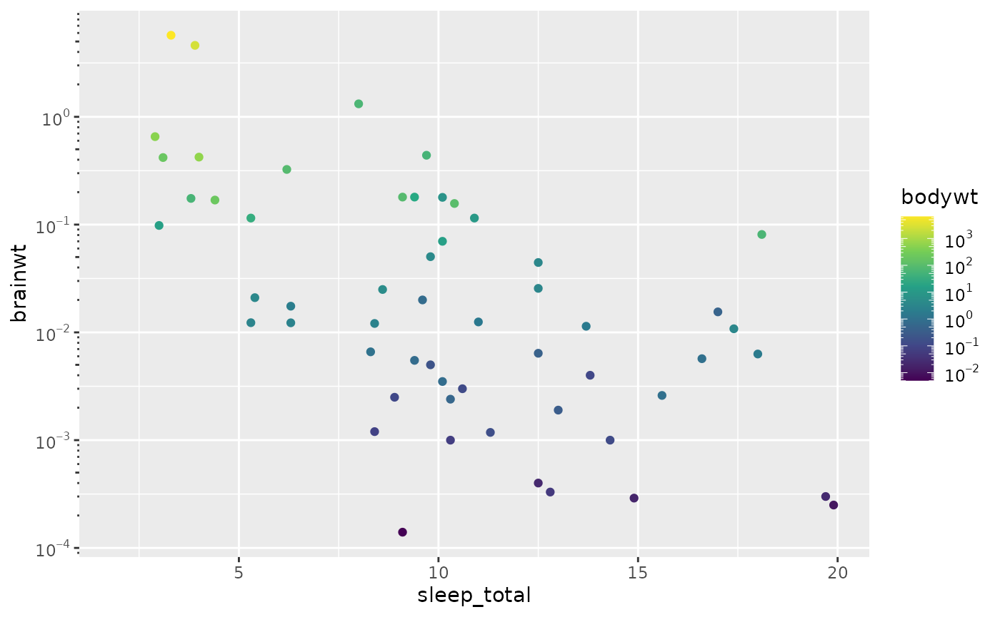
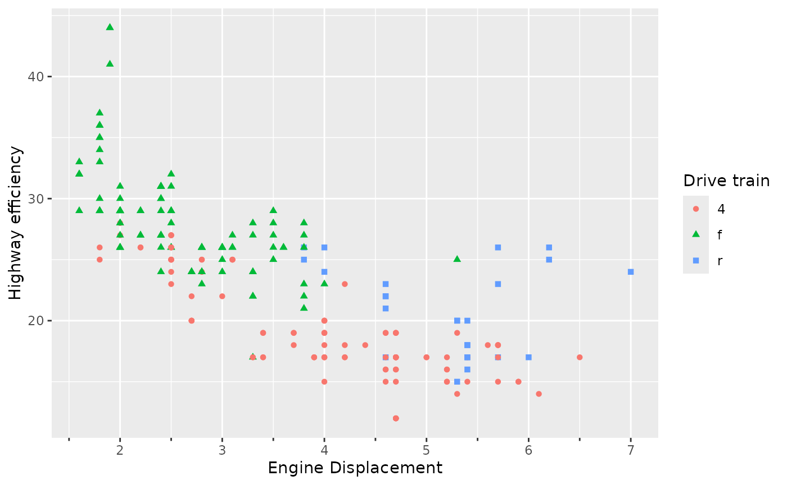
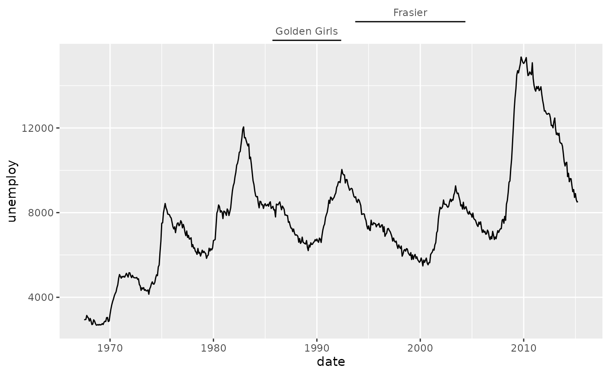
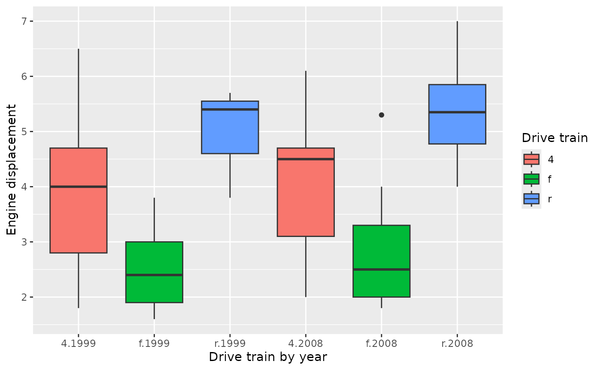
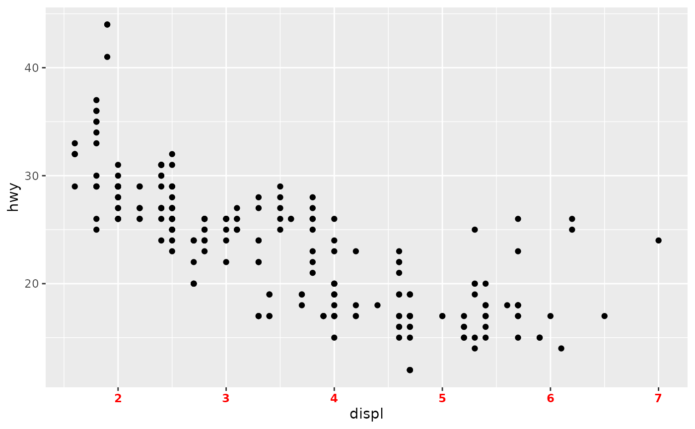
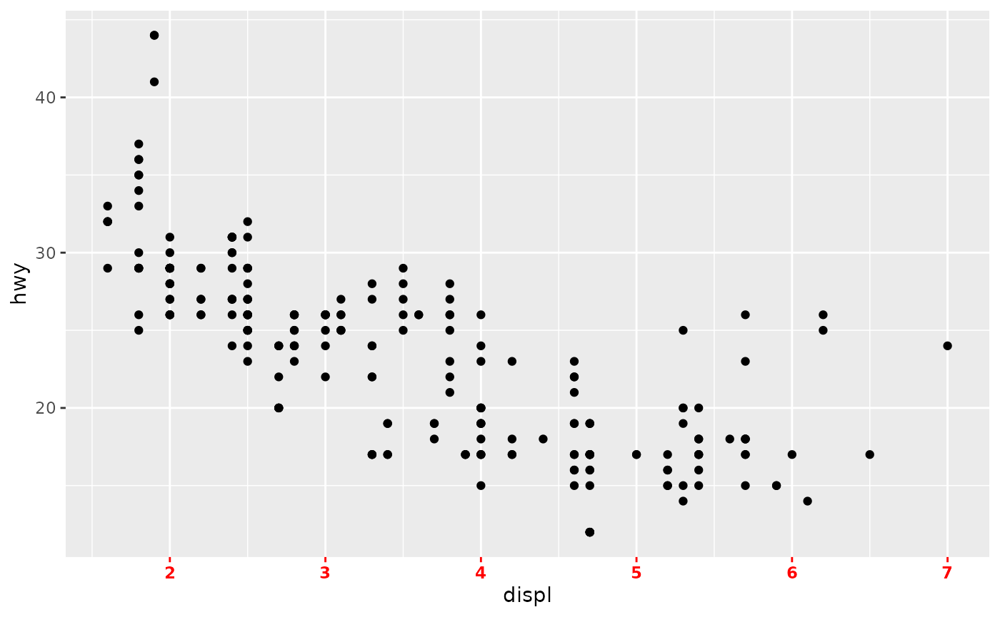
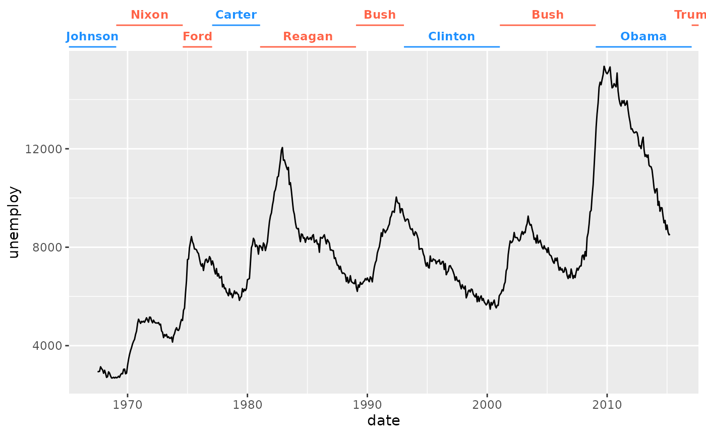
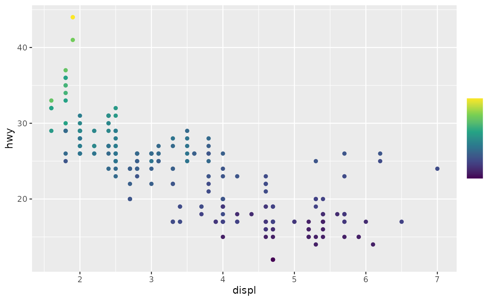

# Key information

``` r

library(legendry)
#> Loading required package: ggplot2
```

Rather than information that is key, this article will discuss
information about keys.

## Keys in vanilla ggplot2

The way guides exchange information with scales is through so called
‘keys’. Keys are simply data frames that typically hold information
about the aesthetic, what values they represent and how these should be
displayed. You may have already seen keys if you’ve used the
[`get_guide_data()`](https://ggplot2.tidyverse.org/reference/get_guide_data.html)
function before, as it can be used to retrieved a guide’s key. In the
data frame below, we can see a key for the ‘x’ aesthetic. It tells us
the relative location of tick marks in the aesthetic’s `x` column, and
the numerical values they represent in the `.value` column. How the
values should be communicated to users is captured in the `.label`
column. Sometimes, keys have information about additional aesthetics,
like the `y` column in the key below.

``` r

standard <- ggplot(mpg, aes(displ, hwy)) +
  geom_point(aes(shape = drv, colour = drv)) +
  labs(
    shape  = "Drive train",
    colour = "Drive train",
    y = "Highway efficiency",
    x = "Engine Displacement"
  )

get_guide_data(standard, aesthetic = "x")
#>           x .value .label y
#> 2 0.1127946      2      2 1
#> 3 0.2811448      3      3 1
#> 4 0.4494949      4      4 1
#> 5 0.6178451      5      5 1
#> 6 0.7861953      6      6 1
#> 7 0.9545455      7      7 1
```

## Keys in legendry

The key difference between keys in legendry and keys in ggplot2, is that
legendry exposes users to keys. At first, this can be an inconvenience,
but it allows for a greater degree of customisation.

### Why use keys?

Before we dig into the different types of keys, it is worth noting
exactly why keys have been exposed. Keys represent ‘rules’ about how to
annotate a scale, whereas the guide is the display of that rule.

For example,
[`key_log()`](https://teunbrand.github.io/legendry/reference/key_standard.md)
instructs to annotate every 10x change with large ticks, and in between
changes with smaller ticks. It doesn’t really matter whether this rule
is applied on an axis or a colour bar. Having the rule independent of
the display makes it more modular.

``` r

logkey <- key_log()

ggplot(msleep, aes(sleep_total, brainwt, colour = bodywt)) +
  geom_point(na.rm = TRUE) +
  scale_y_log10(guide = guide_axis_base(key = logkey)) +
  scale_colour_viridis_c(
    trans = "log10",
    guide = guide_colbar(key = logkey)
  )
```



### Regular keys

The understand better how a typical key works, we can use
[`key_manual()`](https://teunbrand.github.io/legendry/reference/key_standard.md)
to manually create a key. Usually it is sufficient to just provide the
`aesthetic` argument, as the `.value` and `.label` columns automatically
derive from that.

``` r

key_manual(aesthetic = c(2, 4, 6))
#>   aesthetic .value .label
#> 1         2      2      2
#> 2         4      4      4
#> 3         6      6      6
```

If you want custom labels, you can set the `label` argument. Most guides
in legendry accept a `key` argument, which will cause the guide to
display the information in the key, rather than the information
automatically derived from the scale.

``` r

my_key <- key_manual(aesthetic = c(2, 4, 6), label = c("two", "four", "six"))

standard + guides(x = guide_axis_base(key = my_key))
```



In addition, you can provide some automatic keys as keywords. Setting
`key = "minor"`, is the same as setting `key = key_minor()`. In the same
fashion many other `key_*()` functions can be used as keyword by
omitting the `key_`-prefix.

``` r

standard + guides(x = guide_axis_base(key = "minor"))
```


Some keys don’t directly return data frames, but return instructions on
how these keys should interact with scales. For example
[`key_auto()`](https://teunbrand.github.io/legendry/reference/key_standard.md),
the default key for many guides in legendry, needs to know the range in
which to populate tickmarks.

``` r

key <- key_auto()
print(key)
#> function (scale, aesthetic = NULL) 
#> {
#>     aesthetic <- aesthetic %||% scale$aesthetics[1L]
#>     df <- Guide$extract_key(scale, aesthetic)
#>     df <- data_frame0(df, !!!extra_args(...), .error_call = call)
#>     class(df) <- c("key_standard", "key_guide", class(df))
#>     df
#> }
#> <bytecode: 0x555ef28b2e30>
#> <environment: 0x555ef28b5b18>
```

We can preview what values they’d label by letting the key absorb a
scale with known limits.

``` r

template <- scale_y_log10(limits = c(1, 1000))
key(template, "y")
#>   y .value .label
#> 1 0      0      1
#> 2 1      1     10
#> 3 2      2    100
#> 4 3      3   1000
```

### Ranged keys

A special type of guide you may find in legendry are so called ‘ranged’
guides. The only difference with regular guides is that they do not mark
a single point for an aesthetic, but rather use a start- and end-point
to mark a range of the aesthetic. This can be convenient to annotate
co-occurrances between the data you are plotting and other events. For
example, we can annotate the airtimes of TV shows in timeseries data.

``` r

ranges <- key_range_manual(
  start = as.Date(c("1985-09-14", "1993-09-16")),
  end   = as.Date(c("1992-05-09", "2004-05-13")),
  name  = c("Golden Girls", "Frasier"),
  level = 1:2
)
ranges
#>        start        end       .label .level
#> 1 1985-09-14 1992-05-09 Golden Girls      1
#> 2 1993-09-16 2004-05-13      Frasier      2
```

Compared to a regular key, we don’t have an `aesthetic` column, which is
replaced by the `start` and `end` columns. In these cases, we cannot
indicate a single `.value`, but we can still use the `.label` column.
The `.level` column indicates how far we have to offset a range, so
we’ll display “Frasier” farther away than “Golden Girls”.

``` r

ggplot(economics, aes(date, unemploy)) +
  geom_line() +
  guides(x.sec = primitive_bracket(ranges))
```



There is also an ‘automatic’ ranged key, which attempts to find patterns
in the key labels.

``` r

plot <- ggplot(mpg, aes(interaction(drv, year), displ, fill = drv)) +
  geom_boxplot() +
  labs(
    x = "Drive train by year",
    y = "Engine displacement",
    fill = "Drive train"
  )
plot
```


For example an obvious pattern in the x-axis labels of the plot above is
that you first have 3 entries for the 3 drive trains in 1999, followed
by 3 drive trains in 2008. By default,
[`key_range_auto()`](https://teunbrand.github.io/legendry/reference/key_range.md)
tries to split the label on any non-alphanumeric character, but you give
explicit split instructions by using the `sep` argument.

``` r

# Split on literal periods
key <- key_range_auto(sep = "\\.")

plot + guides(x = primitive_bracket(key = key))
```



## Futher gimmicks

### Piping keys

The
[`key_manual()`](https://teunbrand.github.io/legendry/reference/key_standard.md)
and
[`key_range_manual()`](https://teunbrand.github.io/legendry/reference/key_range.md)
functions have equivalents that are easy to pipe. They are called
[`key_map()`](https://teunbrand.github.io/legendry/reference/key_standard.md)
and
[`key_range_map()`](https://teunbrand.github.io/legendry/reference/key_range.md)
respectively, and they can replace doing the following:

``` r

key <- key_range_manual(
  start = presidential$start,
  end   = presidential$end,
  name  = presidential$name
)
```

By the following, more pipe-friendly version:

``` r

key <- key_range_map(
  presidential,
  start = start,
  end   = end,
  name  = name
)
```

Both of these keys would display as something like this:

``` r

ggplot(economics, aes(date, unemploy)) +
  geom_line() +
  guides(x.sec = primitive_bracket(key))
```



### Formatting keys

In addition to having a lot of control over what the keys display, you
also have control over common text formatting operations in keys. Most
key options have an `...` argument that allows many arguments to
[`element_text()`](https://ggplot2.tidyverse.org/reference/element.html)
to be passed on to the labels.

``` r

ggplot(mpg, aes(displ, hwy)) +
  geom_point() +
  guides(x = guide_axis_base(key = key_auto(colour = "red", face = "bold")))
```



In some cases where you know the label in advance, which is almost every
time one uses
[`key_manual()`](https://teunbrand.github.io/legendry/reference/key_standard.md),
[`key_map()`](https://teunbrand.github.io/legendry/reference/key_standard.md)
or their ranged equivalents, you can even vectorise these formatting
options.

``` r

guide <- presidential |>
  key_range_map(
    start = start,
    end   = end,
    name  = name,
    colour = ifelse(party == "Republican", "tomato", "dodgerblue"),
    face  = "bold"
  ) |>
  primitive_bracket()

ggplot(economics, aes(date, unemploy)) +
  geom_line() +
  guides(x.sec = guide)
```



### Forbidden keys

There are, at the time of writing, two keys that you probably shouldn’t
use in your code. These are
[`key_sequence()`](https://teunbrand.github.io/legendry/reference/key_specialty.md)
and
[`key_bins()`](https://teunbrand.github.io/legendry/reference/key_specialty.md).
The hope is that mentioning their use here will prevent experimenting
and subsequent frustration with these keys. You can see that
[`key_sequence()`](https://teunbrand.github.io/legendry/reference/key_specialty.md)
does not produce an informative axis.

``` r

my_sequence_key <- key_sequence(n = 20)
standard +
  guides(x = guide_axis_base(key = my_sequence_key))
```



The reason for this is that this key was designed for colour gradients

``` r

ggplot(mpg, aes(displ, hwy, colour = cty)) +
  geom_point() +
  scale_colour_viridis_c(
    guide = gizmo_barcap(key = my_sequence_key)
  )
```


Likewise,
[`key_bins()`](https://teunbrand.github.io/legendry/reference/key_specialty.md)
was not designed for regular guides, but is specific to colour steps.

``` r

my_bins_key <- key_bins()

ggplot(mpg, aes(displ, hwy, colour = cty)) +
  geom_point() +
  scale_colour_viridis_c(
    guide = gizmo_stepcap(key = my_bins_key)
  )
```


