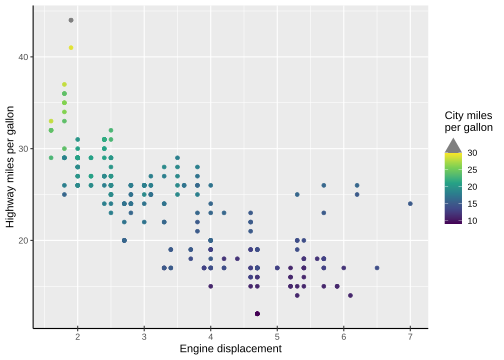
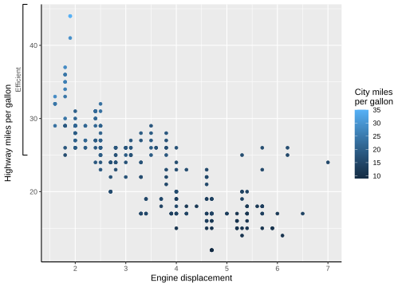
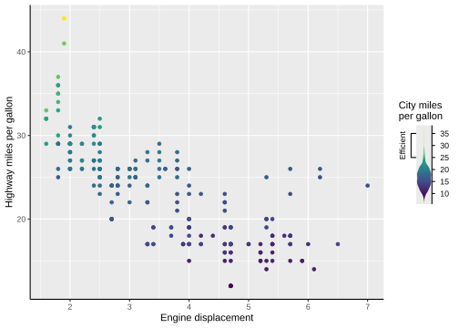

# legendry

The goal of legendry is to provide additional guide functionality to the
ggplot2 ecosystem.

## Installation

You can install the development version of legendry from
[GitHub](https://github.com/) with:

``` r

# install.packages("devtools")
devtools::install_github("teunbrand/legendry")
```

## Example

Let’s first set up a basic plot to experiment with:

``` r

library(legendry)
#> Loading required package: ggplot2

base <- ggplot(mpg, aes(displ, hwy, colour = cty)) +
  geom_point() +
  labs(
    x = "Engine displacement",
    y = "Highway miles per gallon",
    col = "City miles\nper gallon"
  ) +
  theme(axis.line = element_line())
```

The legendry package offers a selection of what it calls ‘complete
guides’. These complete guides can just be drop-in replacement of
regular guides, which you can specify using ggplot2’s
[`guides()`](https://ggplot2.tidyverse.org/reference/guides.html)
function or using the `guide` argument in scales. In the example below,
we’re using two custom variants of vanilla guides, namely
[`guide_axis_base()`](https://teunbrand.github.io/legendry/reference/guide_axis_base.md)
and
[`guide_colbar()`](https://teunbrand.github.io/legendry/reference/guide_colbar.md).
These custom variants have additional options that allow a greater
degree of customisation:

- The axis guide has an option for bidirectional ticks.
- The colourbar automatically recognises out-of-bounds values and
  displays this with a cap.

``` r

base + 
  scale_colour_viridis_c(
    limits = c(NA, 30),
    guide = "colbar"
  ) +
  guides(
    x = guide_axis_base(bidi = TRUE)
  )
```



Besides complete guides, legendry also has incomplete guides that can be
composed. The
[`ggplot2::guide_axis_stack()`](https://ggplot2.tidyverse.org/reference/guide_axis_stack.html)
is an axis composition function that can be used to display multiple
guides. Here, we use a ‘primitive’ guide (incomplete building block) to
display a range on the axis. By stacking it with a regular axis the
primitive guide is completed.

``` r

# A partial guide to display a bracket
efficient_bracket <- primitive_bracket(
  # Keys determine what is displayed
  key = key_range_manual(start = 25, end = Inf, name = "Efficient"),
  bracket = "square",
  # We want vertical text
  theme = theme(
    legend.text = element_text(angle = 90, hjust = 0.5),
    axis.text.y.left = element_text(angle = 90, hjust = 0.5)
  )
)

base + guides(y = guide_axis_stack("axis", efficient_bracket))
```



The legendry package extends this guide composition concept beyond the
axes for other types of guides. In the example below we compose a
‘sandwich’: a central guide flanked by two others. Because our bracket
is a primitive, it does not matter what aesthetic it displays and we can
re-use it for the sandwich. I’ve yet to write the vignette on
composition.

``` r

base + 
  scale_colour_viridis_c(
    guide = compose_sandwich(
      middle = gizmo_density(), 
      text = "axis_base",
      opposite = efficient_bracket
    )
  )
```



## Code of Conduct

Please note that the legendry project is released with a [Contributor
Code of
Conduct](https://teunbrand.github.io/legendry/CODE_OF_CONDUCT.html). By
contributing to this project, you agree to abide by its terms.
